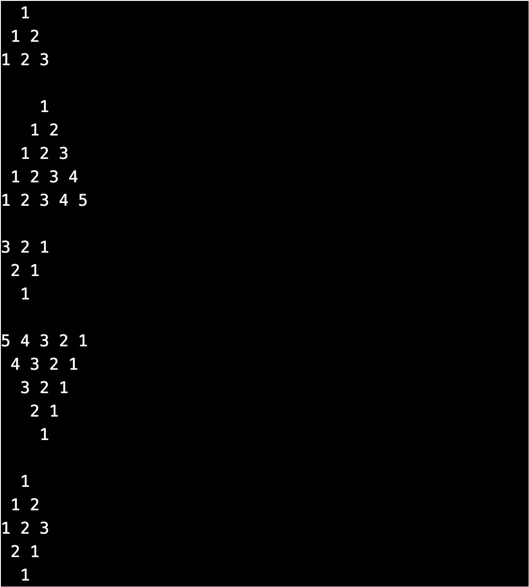
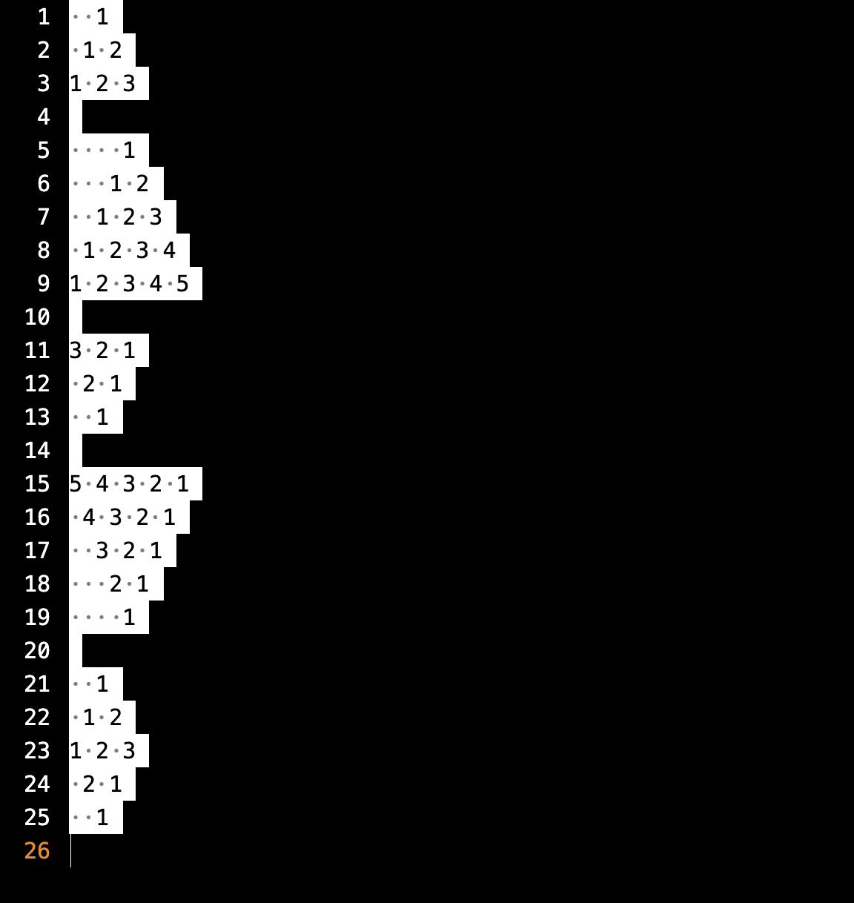

Type Pattern 02
===============

What to Do
----------
Now that you have completed and submitted `pattern01`. Now let's do the `pattern02`.

Run the following 3 commands in `Terminal`.

    cd
    cd mt
    cd pattern02

Your prompt must look like this.

    mt/pattern02/ $

Otherwise re-run the 3 commands.

### #1: Type pattern of numbers

In file `pattern02.txt` type the following pattern.

  

### #2: Check correctness
Once you have completed typing, select all the pattern that is typed, it must look similar to the follows in VSCode editor.  
  
  
To check the correctness, run the following `check50 command` in the `Terminal`.  
```bash
check50 enhance42/clang/2024/mt/pattern02
```
On Mobile run the command in `Terminal`.
```bash
echeck
```

### #3: Submit your work
Once the tests pass, run the following `submit50 command` in the `Terminal` to `submit`.
```bash
submit50 enhance42/clang/2024/mt/pattern02
```
On Mobile run the command in `Terminal`.
```bash
esubmit
```

Next
----
[pattern03](../pattern03/)
