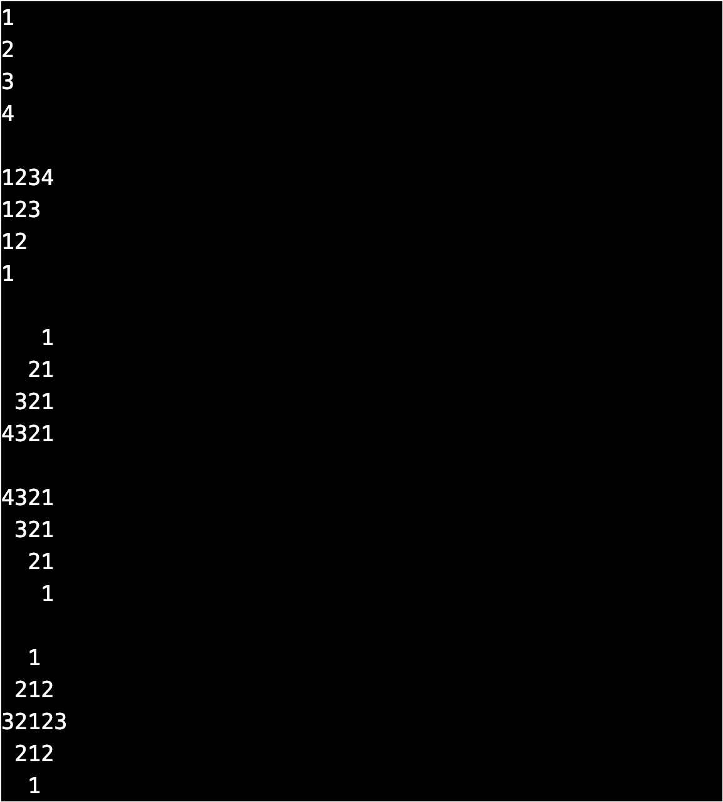

## Type pattern of numbers

In file `pattern01.txt` type the following pattern.



## Run Tests
```bash
check50 enhance42/clang/2024/type/pattern01
```

## Submit your work
```bash
submit50 enhance42/clang/2024/type/pattern01
```

**Note:** `Never submit without tests passing`.

