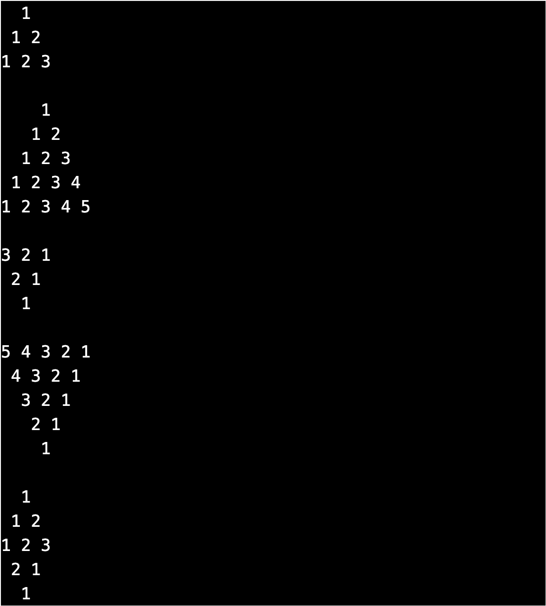

# Instructions
It is very important to read again the instructions everytime something is not working as expected.  

## #1: Type pattern of numbers

In file `pattern02.txt` type the following pattern.

  

## #2: Check correctness
Once you have completed typing, select all the pattern that is typed, it must look similar to the follows in VSCode editor.  
  
  
To check the correctness, run the following `check50 command` in the `Terminal`.  
```bash
check50 enhance42/clang/2024/type/pattern02
```

## #3: Submit your work
Once the tests pass, run the following `submit50 command` in the `Terminal` to `submit`.
```bash
submit50 enhance42/clang/2024/type/pattern02
```
You can submit any number of times, the latest submission will be considered for marks.
